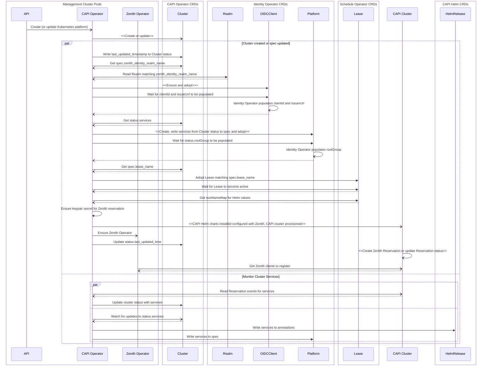
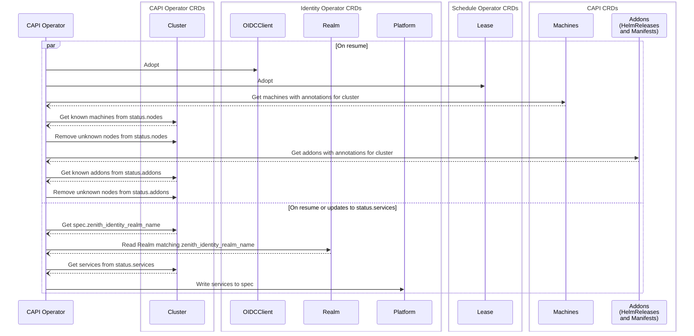

# azimuth-capi-operator

```mermaid
sequenceDiagram
    box Management Cluster Pods
    participant api as API
    participant capi as CAPI Operator
    participant zenith-op as Zenith Operator
    end
    box CAPI Operator CRDs
    participant cluster as Cluster
    end
    box Identity Operator CRDs
    participant realm as Realm
    participant oidcclient as OIDCClient
    participant platform as Platform
    end
    box Schedule Operator CRDs
    participant lease as Lease
    end
    api-)capi: Create (or update Kubernetes platform)
    capi-)cluster: <<Create or update>>
    par Cluster created or spec updated
      capi->>cluster: Write last_updated_timestamp to Cluster status
      capi->>cluster: Get spec.zenith_identity_realm_name
      cluster--)capi:
      capi->>realm: Read Realm matching zenith_identity_realm_name
      realm--)capi:
      capi->>oidcclient: <<Ensure and adopt>>>
      capi->>oidcclient: Wait for clientId and issuerUrl to be populated
      oidcclient-)oidcclient: Identity Operator populates clientId and issuerUrl
      oidcclient--)capi:
      capi->>cluster: Get status.services
      cluster--)capi:
      capi->>platform: <<Create, write services from Cluster status to spec and adopt>>
      capi->>platform: Wait for status.rootGroup to be populated
      platform-)platform: Identity Operator populates rootGroup
      platform--)capi:
      capi->>cluster: Get spec.lease_name
      cluster--)capi:
      capi->>lease: Adopt Lease matching spec.lease_name
      capi->>lease: Wait for Lease to become active
      lease--)capi: 
      capi->>lease: Get sizeNameMap for Helm values
      lease--)capi:
      capi->>capi: Ensure keypair secret for Zenith reservation
      participant capi-cluster as CAPI Cluster
      capi-)capi-cluster: <<CAPI Helm charts installed configured with Zenith, CAPI cluster provisioned>>
      capi-)zenith-op: Ensure Zenith Operator
      capi->>cluster: Update status.last_updated_time
      capi-cluster-)capi-cluster: <<Create Zenith Reservation or update Reservation status>>
      zenith-op-)capi-cluster: Get Zenith clients to register
      capi-cluster--)zenith-op:
    and Monitor Cluster Services
      par
        capi-)capi-cluster: Read Reservation events for services
        capi-cluster--)capi:
        capi->>cluster: Update cluster status with services
      and
        capi-)cluster: Watch for updates to status.services
        cluster--)capi:
        box CAPI Helm CRDs
        participant helmrelease as HelmRelease
        end
        capi->>helmrelease: Write services to annotations
        capi->>platform: Write services to spec
      end
    end
```

```mermaid
sequenceDiagram
    participant capi as CAPI Operator
    box CAPI Operator CRDs
    participant cluster as Cluster
    end
    box Identity Operator CRDs
    participant oidcclient as OIDCClient
    participant realm as Realm
    participant platform as Platform
    end
    box Schedule Operator CRDs
    participant lease as Lease
    end
    box CAPI CRDs
    participant machines as Machines
    participant addons as Addons <br/> (HelmReleases <br/> and Manifests)
    end
    par On resume
      capi->>oidcclient: Adopt
      capi->>lease: Adopt
      capi->>machines: Get machines with annotations for cluster
      machines--)capi:
      capi->>cluster: Get known machines from status.nodes
      cluster--)capi:
      capi->>cluster: Remove unknown nodes from status.nodes
      capi->>addons: Get addons with annotations for cluster
      addons--)capi:
      capi->>cluster: Get known addons from status.addons
      cluster--)capi:
      capi->>cluster: Remove unknown nodes from status.addons
    and On resume or updates to status.services
      capi->>cluster: Get spec.zenith_identity_realm_name
      cluster--)capi:
      capi->>realm: Read Realm matching zenith_identity_realm_name
      realm--)capi:
      capi->>cluster: Get services from status.services
      cluster--)capi:
      capi->>platform: Write services to spec
    end
```
