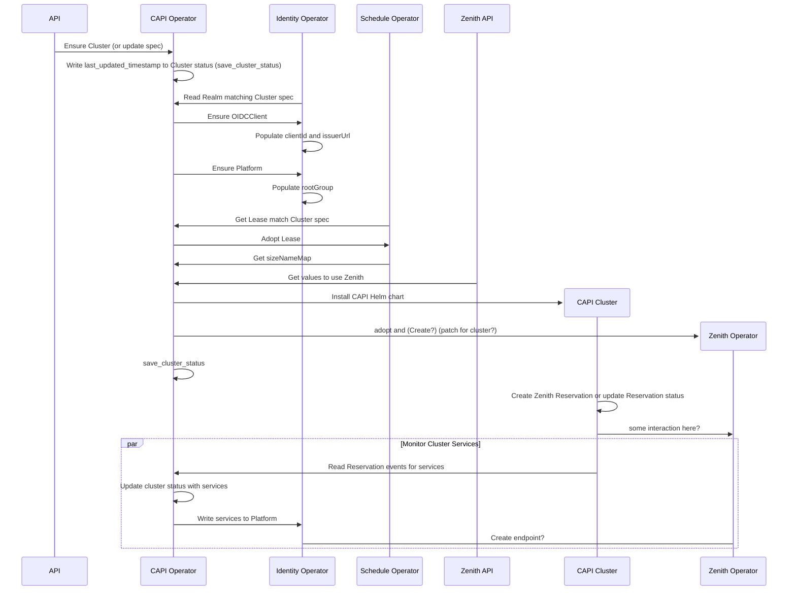
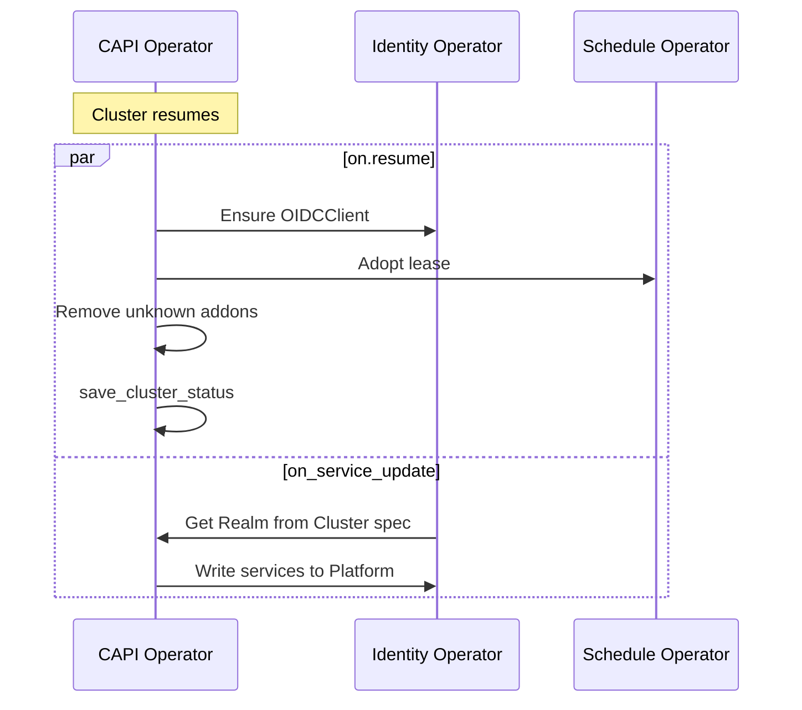

# azimuth-capi-operator

```mermaid
sequenceDiagram
    participant api as API
    participant capi as CAPI Operator
    participant identity as Identity Operator
    participant schedule as Schedule Operator
    participant zenith-api as Zenith API
    api->>capi: Ensure Cluster (or update spec)
    capi->>capi: Write last_updated_timestamp to Cluster status (save_cluster_status)
    identity->>capi: Read Realm matching Cluster spec
    capi->>identity: Ensure OIDCClient
    identity->>identity: Populate clientId and issuerUrl
    capi->>identity: Ensure Platform
    identity->>identity: Populate rootGroup
    schedule->>capi: Get Lease match Cluster spec
    capi->>schedule: Adopt Lease
    schedule->>capi: Get sizeNameMap
    zenith-api->>capi: Get values to use Zenith
    create participant cluster as CAPI Cluster
    capi->>cluster:Install CAPI Helm chart
    create participant zenith-op as Zenith Operator
    capi->>zenith-op: adopt and (Create?) (patch for cluster?)
    capi->>capi: save_cluster_status
    cluster->>cluster: Create Zenith Reservation or update Reservation status
    cluster->>zenith-op: some interaction here?
    par Monitor Cluster Services
      cluster->>capi: Read Reservation events for services
      capi->>capi: Update cluster status with services
      capi->>identity: Write services to Platform
      identity->zenith-op:Create endpoint?
    end
```

```mermaid
sequenceDiagram
    participant capi as CAPI Operator
    participant identity as Identity Operator
    participant schedule as Schedule Operator
    note over capi: Cluster resumes
    par on.resume
    capi->>identity: Ensure OIDCClient
    capi->>schedule: Adopt lease
    capi->>capi: Remove unknown addons
    capi->>capi: save_cluster_status
    and on_service_update
    identity->>capi: Get Realm from Cluster spec
    capi->>identity: Write services to Platform
    end
```
